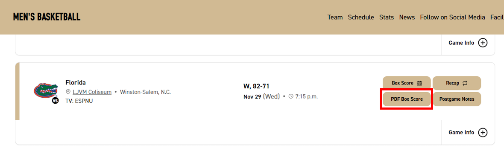

## Live Stats Tracker
This app takes play by play data from NCAA basketball games and compiles the stats for each lineup into a table form. The app is live for the 2021-22 Wake Forest Basketball Team [here](https://awbridgers.github.io/live-stats-tracker/).
___
### How to Use
If you would like to use this app for your own team, you will need  to clone it and change the roster variable found inside the *roster.ts* file to the roster of the team you want to track. 
Make sure each player in the roster array is of form:  ```{name: 'Full Name', number: 0}```
#### Instructions
1. Find the Official Box Score from the game powered by LiveStats. This can often be found on the team's schedule on their website listed as *Box Score (PDF)* or *PDF Box Score*.  Example:



2. Open the Box Score and scroll down to the start of the play by play information. Copy **EVERYTHING** under *Quarter Starters* up to and including the end of the half, denoted by *END OF PERIOD*. Copy and paste that information into the text box of the tracker.
3. For the second half and overtime, copy from the time of the first play through the end of the period, denoted by either *END OF PERIOD* or *END OF GAME*. Do not copy the starter information for the second half or OT, that info is only needed for the initial lineup on the court. Paste that information in the text box as well.
4. Press *Submit* 

Here is a full example:

https://github.com/awbridgers/live-stats-tracker/assets/16521414/430c47f3-cb63-4ea0-a3c1-a460970a8172

#### For SideArm
1. If the PDF Box Score was made using the SideArm program instead of LiveStats, you have to enter the starting lineup manually using the SideArm Format (LASTNAME,FIRSTNAME). Enter the 5 players' names manually with a space between them.
2. Copy the play by play data until the end of the first half and past it into the box.
3. **Manually enter 'END OF PERIOD' on the next line of the input box.**
4. Copy the second half data and past it into the box.
5. **Manually enter 'END OF GAME' at the end of the game.**
6. Press *Submit*
___
### Author
Adam Bridgers
